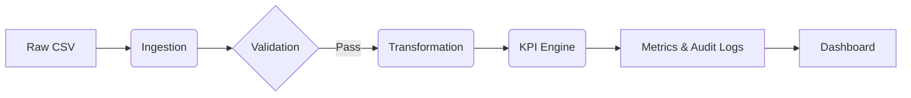

# System Architecture

## Overview
The ABACO Financial Intelligence Platform is designed as a modular, Python-based analytics engine that processes loan portfolio data to generate actionable KPIs and visualizations.

## Components

### 1. Core Logic (`python/`)
The business logic is isolated from the presentation layer to ensure testability and reusability.
- **Ingestion**: `ingestion.py` handles loading data from CSVs, applying timestamps, and tracking run IDs.
- **Validation**: `validation.py` enforces schema constraints (required columns, numeric types).
- **Transformation**: `transformation.py` normalizes data structures for KPI calculation.
- **KPI Engine**: `kpi_engine.py` orchestrates the calculation of PAR30, PAR90, Collection Rate, and Portfolio Health.
- **Financial Analysis**: `financial_analysis.py` provides advanced metrics like HHI (concentration risk) and weighted averages.

### 2. Data Pipeline (`scripts/run_data_pipeline.py`)
A linear pipeline that executes the following stages:
1.  **Ingest**: Load raw CSV data.
2.  **Validate**: Check for critical data quality issues.
3.  **Transform**: Prepare data for calculation.
4.  **Calculate**: Compute KPIs using the Engine.
5.  **Output**: Save results to `data/metrics/` (Parquet/CSV) and logs to `logs/runs/`.

### 3. Dashboard (`streamlit_app.py`)
A Streamlit application that serves as the frontend for:
- Interactive data exploration.
- Visualizing growth projections.
- Exporting reports and slide payloads.

## Data Flow
