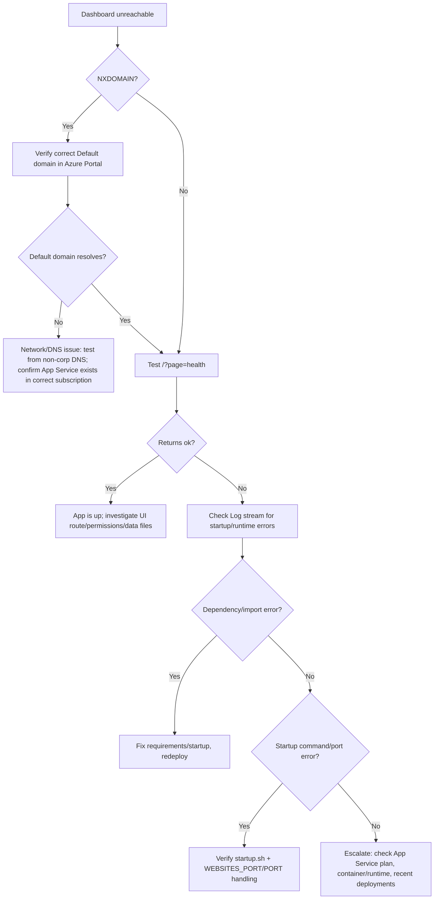

# Runbook: Dashboard Down (Azure App Service)

**Symptoms**

- Browser error: `DNS_PROBE_FINISHED_NXDOMAIN` or site won’t load.
- Health check fails: `/?page=health` does not return `ok`.

**Primary goals**

1. Confirm the correct hostname.
2. Confirm App Service is running.
3. Identify startup/runtime failure from logs.

## Triage (5–10 minutes)

1) **Confirm the correct URL**

- Azure Portal → App Service → Overview → copy **Default domain**.
- Test:
  - `https://<default-domain>/?page=health` (should return `ok`)
  - `https://<default-domain>/` (should render Streamlit)

1) **Confirm the App Service is running**

- Azure Portal → App Service → Overview
  - Status: Running
- Azure Portal → App Service → Diagnose and solve problems → Availability and Performance checks

1) **Check app logs (fastest signal)**

- Azure Portal → App Service → Log stream
- Look for:
  - missing module / import errors
  - port binding issues
  - startup command errors

## Decision flow

## Evidence to capture

- Azure: App Service name, resource group, default domain.
- Log stream excerpt covering the first error.
- Last deployment time and the deploy workflow run URL.

## Common fixes

- **Wrong hostname tested**: use the exact **Default domain** shown in Azure Portal.
- **Deploy health check aimed at wrong hostname**: ensure deploy workflow checks the resolved `defaultHostName`.
- **App fails to start**: fix missing dependency or startup command and redeploy.

## Owner checklist

- [ ] Confirm Default domain and health check response
- [ ] Confirm running status + instance health
- [ ] Capture log stream evidence
- [ ] Redeploy last known good if necessary
